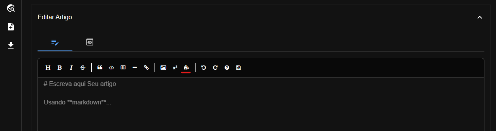
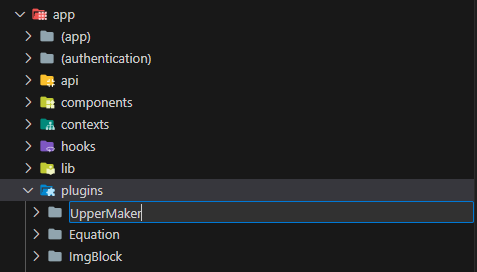
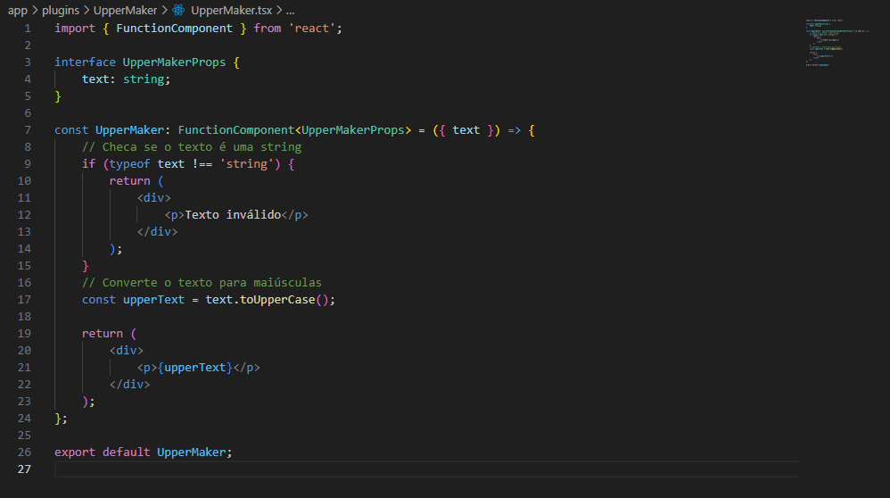
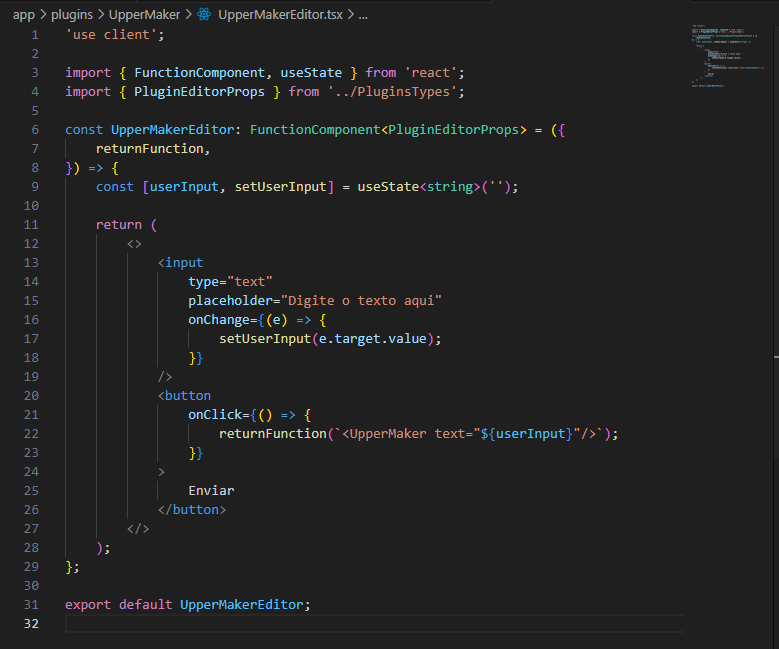
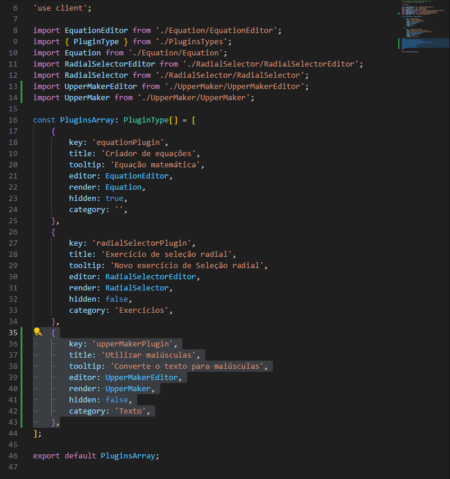
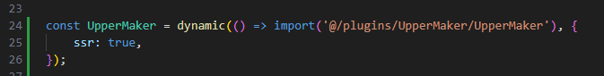

# Plugins

Plugins são uma maneira de aprimorar e adicionar interatividade a conteúdos publicados.

Os Plugins podem ser acessados na Barra de ferramentas do editor.



## Criando um novo plugin

Você pode contribuir com o EducaUTF criando novos plugins!

Criar um plugin é fácil, vou te mostrar como fazer.

Vamos criar um plugin que converte o input do usuário para letras maiúsculas.

### Preparação

O primeiro passo é criar uma pasta com o nome de seu plugin, todos os plugins devem **Ter sua própria pasta**.

Vá até a pasta `/app/plugins/` e crie a sua pasta, chamarei de `UpperMaker`.



Agora vou criar 2 arquivos:

* `UpperMaker.tsx`: Esse é o componente que será renderizado para os leitores.

* `UpperMakerEditor.tsx`: Esse é o componente que o autor usará para editar o conteúdo.

### UpperMaker.tsx

Vamos começar criando o componente que será renderizado.



Esse componente recebe uma string chamada `text` como `prop`, checa se ela é uma string válida e logo em seguida renderiza o texto em letras maiúsculas.

!!! tip "dica"
    Você pode utilizar outras bibliotecas, css e o que mais desejar para criar esse componente. Se divirta!

### UpperMakerEditor.tsx

Agora vamos para o editor, todos os editores serão renderizados dentro de um modal. Você não precisa se preocupar com isso.



Os editores recebem algumas `props` por padrão, por tanto vamos começar utilizando o tipo `PluginEditorProps` para nos fornecer intellisense.

Todos os plugins devem utilizar a função `returnFunction` essa função recebe uma o componente que deve ser renderizado como uma `string`.

### Adicionando à barra de ferramentas

Para adicionar seu plugin à barra de ferramentas você deve atualizar o arquivo `/app/plugins/PluginsArray.tsx`.

Vamos adicionar o novo plugin



Preencha as informações como achar melhor, utilize o intellisense para mais informações sobre os parâmetros.

### Adicionando o plugin ao renderizador

Por fim vá ao arquivo `/app/plugins/useOverridePlugins.tsx` para permitir que o renderizador utilize seu plugin.

O primeiro passo é importá-lo dinamicamente:



E por fim adicioná-lo aos *overrides*

```react
'use-client';

import ImgBlock from '@/plugins/ImgBlock/ImgBlock';
import PreBlock from '@/plugins/PreBlock/PreBlock';
import { MarkdownToJSX } from 'markdown-to-jsx';
import dynamic from 'next/dynamic';
import { useMemo } from 'react';

const Equation = dynamic(() => import('@/plugins/Equation/Equation'), {
	ssr: true,
});
const RadialSelector = dynamic(
	() => import('@/plugins/RadialSelector/RadialSelector'),
	{
		ssr: true,
	}
);

const UpperMaker = dynamic(() => import('@/plugins/UpperMaker/UpperMaker'), {
	ssr: true,
});

const useOverridePlugins = () => {
	const overrides = useMemo<MarkdownToJSX.Overrides>(() => {
		return {
			pre: PreBlock,
			Equation: Equation,
			img: ImgBlock,
			RadialSelector: RadialSelector,
			UpperMaker: UpperMaker,
		};
	}, []);

	return [overrides] as const;
};

export default useOverridePlugins;
```