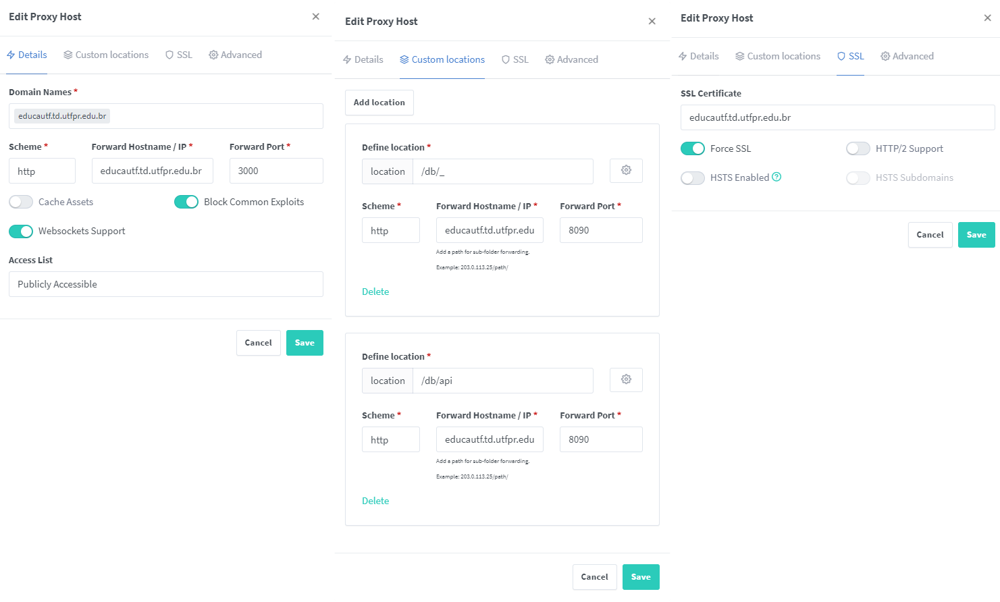

<!--
 Copyright (c) 2023 Rafael Farias
 
 This software is released under the MIT License.
 https://opensource.org/licenses/MIT
-->

# Proxy Reverso

Aqui será apresentado a arquitetura, setup e configuração do proxy reverso da aplicação.

## Nginx Proxy Manager
Para o proxy reverso foi utilizado o [Nginx Proxy Manager](https://nginxproxymanager.com/), o deploy foi feito através do container `Docker` e `Docker Compose`.

## Configurando o proxy
Para acessar o serviço é necessário que seja acessado via a rede da UTFPR-toledo, ou então fazendo uso da [VPN](https://wiki.td.utfpr.edu.br/doku.php?id=manual:vpn).

O acesso pode ser feito via `HTTP` no endereço `educautf.td.utfpr.edu.br:81`

### Proxy Hosts
O seguinte proxy host foi configurado:

Com as seguintes configurações:

!!! Attention "Atenção"
    As configurações podem estar desatualizadas.

### Certificado SSL
Ao selecionar *`Add SSL Certificate`* e *`Custom`* você será apresentado a seguinte tela:

Os arquivos relacionados ao certificado são:

* `*.key`: Deverá ser inserido no campo `Certificate key`, atenção essa é uma chave **PRIVADA**;
* `*.cer`: Deverá ser inserido no campo `Certificate`;
* `*.pem`: Deverá ser inserido no campo `Intermediate Certificate`;

